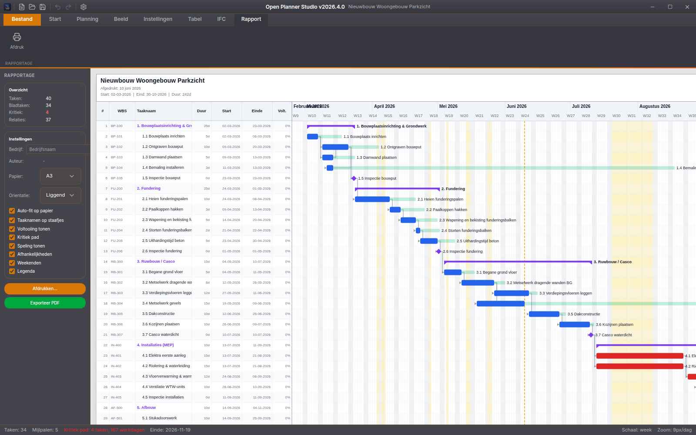

# Open Planner Studio

Open-source bouwplanningapplicatie voor de bouwsector. Native IFC-bestandsformaat.


## Kenmerken

- **Gantt-diagrammen** met interactieve Canvas-rendering, drag & drop, en zoom
- **Critical Path Method (CPM)** — automatische berekening kritiek pad en float
- **Work Breakdown Structure (WBS)** — hierarchische taakstructuur met inklapbare hoofdstukken
- **IFC-native** — opslaan en openen in IFC 4.3 (buildingSMART standaard)
- **Ribbon toolbar** — Microsoft Office-achtige ribbon met tabbladen
- **Meertalig** — 14 talen: Nederlands, English, Français, Deutsch, Español, 中文, Italiano, Português, Polski, Türkçe, العربية, 日本語, 한국어, فارسی (incl. RTL voor Arabisch en Perzisch)
- **Tabelweergave** — Excel-achtige editor met dubbelklik-bewerking
- **Rapportage** — live afdrukvoorbeeld in de ribbon met instelbare opties
- **Context menu** — rechtermuisknop voor snelle acties op taken
- **Resource management** — arbeid, materieel, onderaannemers
- **Bouwsector-specifiek** — feestdagen, bouwvak, inspectiemomenten, fasering
- **4D BIM-ready** — koppeling planning aan IFC-gebouwmodel




## Snel starten

```bash
# Installeer dependencies
npm install

# Start development server
npm run dev

# Open in browser
open http://localhost:3007
```

## Technologiestack

| Laag | Technologie |
|------|-------------|
| Desktop | Tauri 2 |
| Frontend | React 19 + TypeScript |
| Rendering | HTML5 Canvas 2D |
| State | Zustand + Immer |
| Styling | TailwindCSS 4 + component-CSS |
| i18n | react-i18next (14 talen) |
| Build | Vite 7 |

## Projectstructuur

```
src/
  components/
    backstage/       # Backstage (Office-achtig File-menu)
    canvas/          # GanttCanvas, ContextMenu
    common/          # Herbruikbare UI-componenten (Select)
    dialogs/         # TaskDialog, ProjectInfoDialog, SettingsDialog
    layout/          # Ribbon, MenuBar, StatusBar, TitleBar
    panels/          # TableEditor, IFCPanel, ReportPanel, TaskPropertiesPanel, DebugTerminal
    settings/        # Instellingen-paneelinhoud
  engine/
    renderer/        # GanttRenderer (Canvas 2D)
    scheduler/       # CPMSolver, CalendarEngine
  hooks/             # Toetsenbord- en zoom-hooks
  i18n/              # Vertalingen (14 talen)
  services/
    ifc/             # IFC 4.3 lezen/schrijven (native formaat)
    csv/             # CSV import/export
    msproject/       # MS Project (.xml) import/export
    p6/              # Primavera P6 (.xml) import/export
    print/           # Afdrukvoorbeeld
    debug/           # Logbus (debug terminal)
  state/             # Zustand store (+ slices/types.ts)
  styles/            # Globale CSS + Tailwind
  types/             # TypeScript types (Task, Sequence, Resource, Calendar, Project)
  utils/             # Datum-utils, ID-generator, instellingen-opslag
examples/            # Voorbeeld IFC-planningen
```

## Ribbon Tabs

| Tab | Functie |
|-----|---------|
| **Start** | Bestand, Bewerken, Taken toevoegen, CPM berekenen, Zoom |
| **Planning** | CPM, Relaties beheren, Kalender, Vrije dagen |
| **Beeld** | Zoom, Tijdschaal, Panelen, Afdrukken |
| **Instellingen** | Project info, Kalender, Taalinstelling |
| **Tabel** | Excel-achtige tabelweergave met inline bewerking |
| **IFC** | IFC 4.3 code-editor met genereren/toepassen |
| **Rapport** | Live afdrukvoorbeeld met instelbare opties |

## Architectuur

Volgt het patroon van [Open 2D Studio](https://github.com/OpenAEC-Foundation/Open-2D-Studio) en [Open FEM2D Studio](https://github.com/OpenAEC-Foundation/Open-FEM2D-Studio).

Zie [PLAN.md](PLAN.md) voor het volledige projectplan.

## Voorbeelden

Zie de [`examples/`](examples/) map voor voorbeeldplanningen in IFC-formaat.

## Licentie

LGPL-3.0
