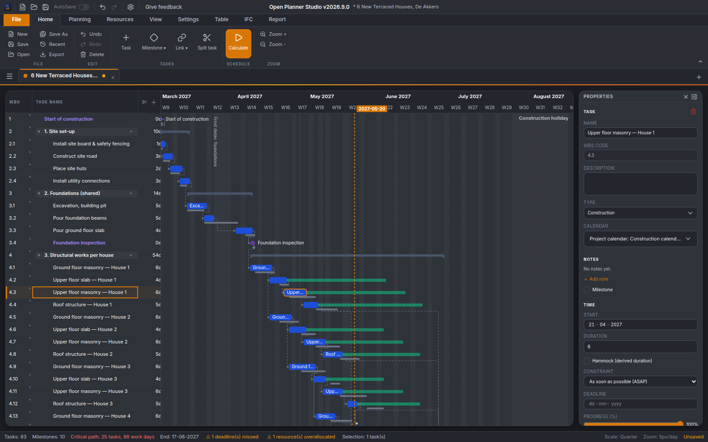
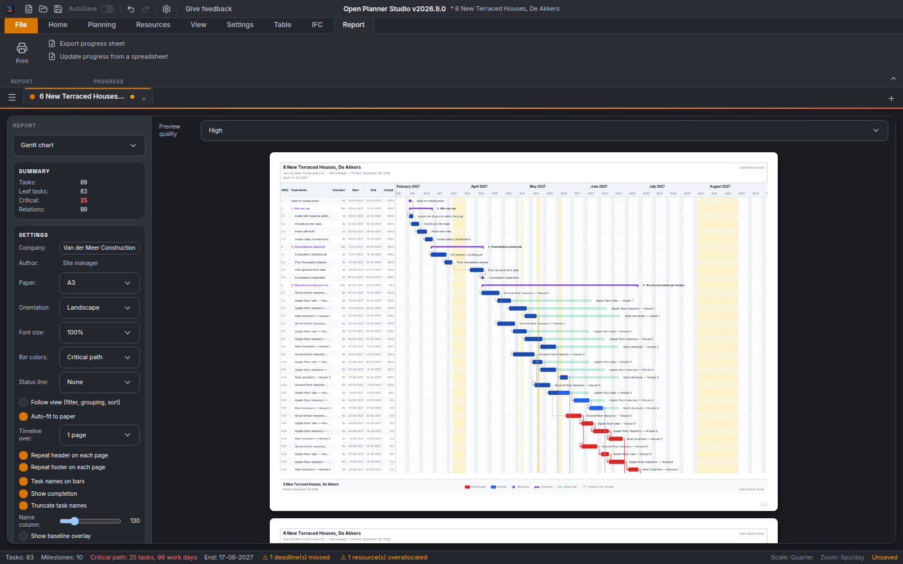
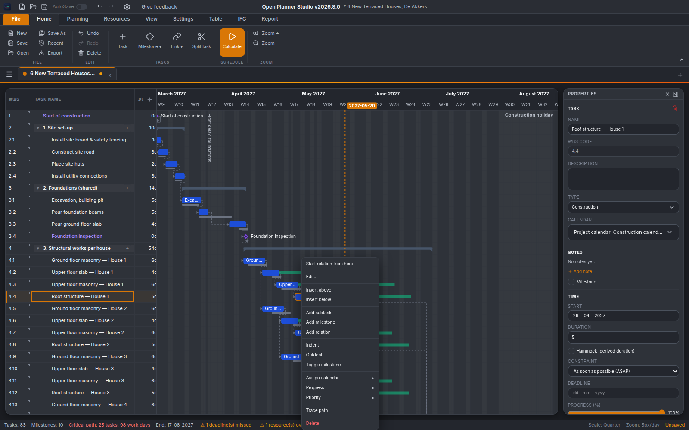

# Open Planner Studio

[](https://github.com/OpenAEC-Foundation/open-planner-studio/releases)
[](https://github.com/OpenAEC-Foundation/open-planner-studio/releases)
[](https://github.com/OpenAEC-Foundation/open-planner-studio/actions/workflows/ci.yml)
[](https://open-planner-studio.open-aec.com)
[](tests/planning/README.md)
[](src/i18n/config.ts)
[](#licentie)

Open-source bouwplanningapplicatie voor de bouwsector. Native IFC-bestandsformaat.



## Kenmerken

- **Gantt-diagrammen** met interactieve Canvas-rendering, drag & drop (ook verticaal, om taken te herschikken of te herparenten), en zoom
- **Critical Path Method (CPM)** — automatische berekening kritiek pad en float
- **Work Breakdown Structure (WBS)** — hierarchische taakstructuur met inklapbare hoofdstukken
- **IFC-native** — opslaan en openen in IFC 4.3 (buildingSMART standaard)
- **Ribbon toolbar** — Microsoft Office-achtige ribbon met tabbladen
- **Meertalig** — 14 talen: Nederlands, English, Français, Deutsch, Español, 中文, Italiano, Português, Polski, Türkçe, العربية, 日本語, 한국어, فارسی (incl. RTL voor Arabisch en Perzisch)
- **Tabelweergave** — spreadsheet-achtige editor: één klik op een cel bewerkt hem direct
- **Resourcebibliotheken** — resources en kalenders in een gedeelde, bedrijfsbrede bibliotheek waar meerdere projecten uit putten, met herkomststempels per item
- **AI-assistent (MCP)** — de app kan zichzelf openstellen als MCP-server, zodat een AI-assistent live met de open planning meewerkt, met veiligheidsvlaggen (pauze/alleen-lezen/auto-backup) en een activiteitenlog
- **Rapportage** — live afdrukvoorbeeld in de ribbon met instelbare opties
- **Context menu** — rechtermuisknop voor snelle acties op taken
- **Bouwsector-specifiek** — feestdagen, bouwvak, inspectiemomenten, fasering
- **4D BIM-ready** — koppeling planning aan IFC-gebouwmodel





## Snel starten

```bash
# Installeer dependencies (ci, niet install — de lockfile is bindend)
npm ci

# Start de dev-server; hij print zelf op welke poort hij draait
npm run dev
```

`npm run dev` wijst deze map een vaste poort toe in het bereik 3007–3106 en houdt
die vast over herstarts heen, zodat meerdere kopieën van de repo naast elkaar
kunnen draaien zonder elkaars poort af te pakken.

Meebouwen? Zie [CONTRIBUTING.md](CONTRIBUTING.md).

## Technologiestack

| Laag | Technologie |
|------|-------------|
| Desktop | Tauri 2 |
| Frontend | React 19 + TypeScript |
| Rendering | HTML5 Canvas 2D |
| State | Zustand + Immer |
| Styling | TailwindCSS 4 + component-CSS |
| i18n | react-i18next (14 talen) |
| Build | Vite 7 |

## Projectstructuur

```
src/
  components/        # React-schil: ribbon (incl. ribbon/ai), backstage, panelen, dialogen, canvas-chrome
  engine/            # renderer/ (Canvas 2D), scheduler/ (CPM + resources), calendar/, view/
  services/          # ifc/ (het native formaat) · import/export (csv, msproject, p6)
                     # · fileAccess/ (Tauri↔web) · recovery/ · print/ · pdf/ · updater/
                     # · feedback/ · library/ · mcp/ · benchmark/ · debug/
  state/             # Zustand+Immer store: slices/ + het documentcontract
  extensions/        # Extensiesysteem (types, api, loader, service)
  i18n/              # Vertalingen, 14 talen × 4 namespaces
  hooks/  types/  utils/  styles/
public/docs/         # In-app handleiding: 34 artikelen × 14 talen (voedt ook de wiki)
examples/            # Voorbeeldplanningen in IFC
tests/               # planning · library · mcp · dev-server · browser
src-tauri/           # De Rust-schil (dun: precies één native command)
```

Deze boom is bewust grofmazig — een uitgeschreven versie loopt binnen een maand
achter. Voor de details en de architectuurbeslissingen: [CLAUDE.md](CLAUDE.md)
en [AGENTS.md](AGENTS.md).

## Ribbon Tabs

| Tab | Functie |
|-----|---------|
| **Start** | Bestand, Bewerken, Taken toevoegen, CPM berekenen, Zoom |
| **Planning** | CPM, Relaties beheren, Kalender, Structuur (codes/velden, in-/uitspringen), Baselines |
| **Resources** | Resources toewijzen, histogram, nivellering |
| **Beeld** | Zoom, Tijdschaal, Panelen, Groeperen/filteren |
| **Instellingen** | Project info, Kalender, Taalinstelling |
| **Tabel** | Spreadsheet-achtige tabelweergave, één klik bewerkt een cel |
| **IFC** | IFC 4.3 code-editor met genereren/toepassen |
| **Rapport** | Live afdrukvoorbeeld met instelbare opties |
| **AI** *(standaard uit, aan te zetten in Instellingen)* | MCP-bridge starten/verbinden, veiligheidsvlaggen, activiteitenlog |

Plus **Bestand** — de Backstage: recent, voorbeelden, importeren/exporteren,
printen, projectgegevens, instellingen, extensies, bibliotheek en help.

## Architectuur

Onderdeel van de OpenAEC-Foundation-familie van desktop-apps, die een gedeeld patroon delen (Tauri 2 + React + Canvas, Office-achtige ribbon, `lucide-react`). De algehele shell volgt [Open 2D Studio](https://github.com/OpenAEC-Foundation/Open-2D-Studio) en [Open FEM2D Studio](https://github.com/OpenAEC-Foundation/Open-FEM2D-Studio); het [extensiesysteem](docs/extensions.md) en de huidige styling zijn gemodelleerd naar [Open Calc Studio](https://github.com/OpenAEC-Foundation/open-calc-studio).

Zie [PLAN.md](PLAN.md) voor de roadmap. Let op: hoofdstuk 4 daarvan is een
aangenomen ontwerp uit de ontwerpfase en beschrijft de huidige code niet — er
staat een waarschuwing boven.

## Voorbeelden

Zie de [`examples/`](examples/) map voor voorbeeldplanningen in IFC-formaat.

## Bijdragen

Zie [CONTRIBUTING.md](CONTRIBUTING.md) — opzetten, de poort (`npm run verify`,
met de vijf testsuites `planning`/`library`/`mcp`/`dev-server`/`browser`), en de
vier dingen die het vaakst stil misgaan. Beveiligingsproblemen niet via een
issue maar via [SECURITY.md](SECURITY.md).

## Licentie

LGPL-3.0
